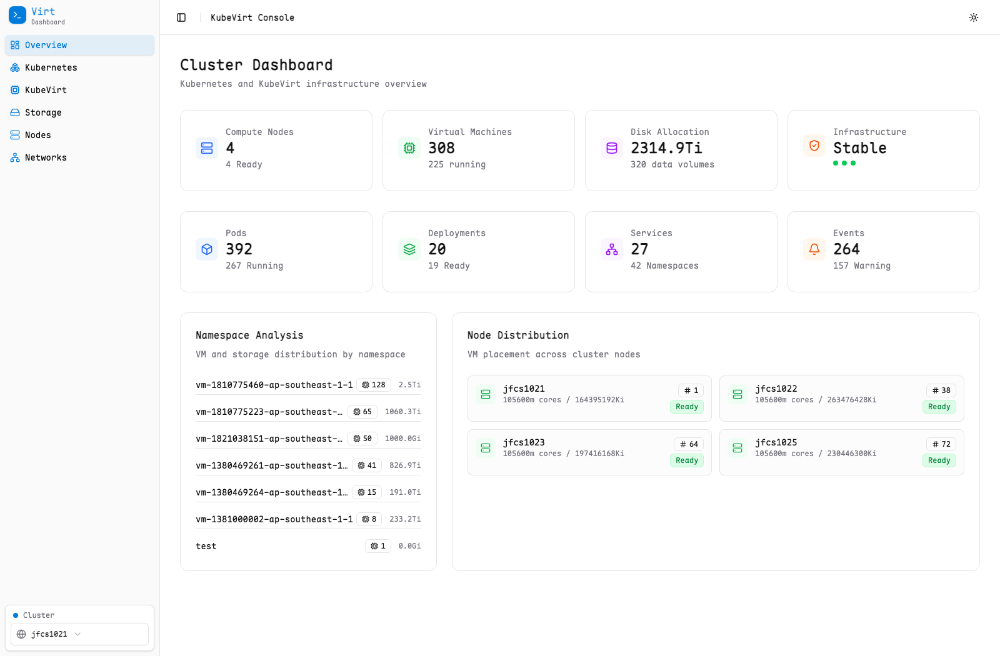
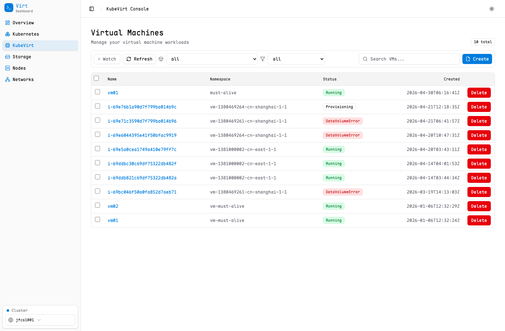
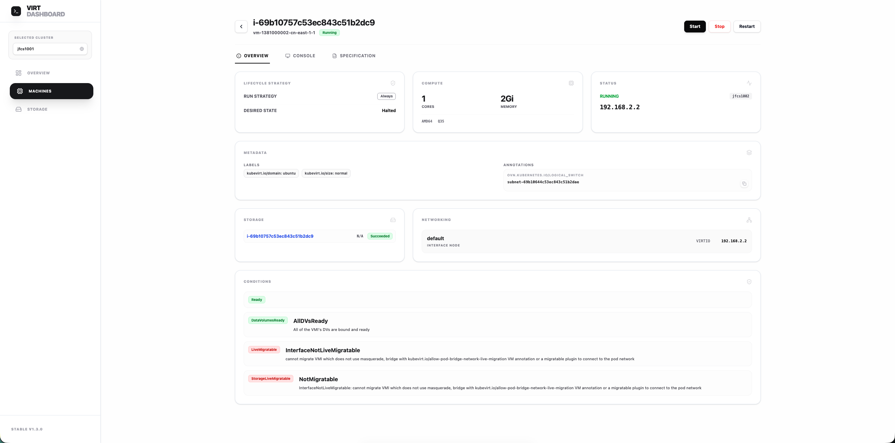
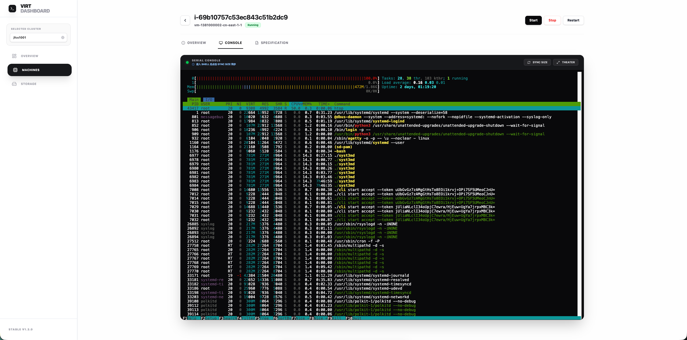

# KubeVirt Dashboard

A lightweight, single-binary, and modern web-based management console for KubeVirt clusters.



## Features

- **Multi-Cluster Support**: Manage multiple Kubernetes clusters by switching contexts directly from the UI.
- **Cluster Dashboard**: High-level overview of nodes health, KubeVirt infrastructure stability, and resource distribution.
- **VM Management**: List, start, stop, restart, and view detailed information of Virtual Machines.
- **Serial Console**: High-performance, low-latency serial console using xterm.js with "Theater Mode".
- **Storage Analytics**: View DataVolumes details, including total storage requests aggregated by namespace.
- **Clean Manifests**: Integrated YAML viewer that automatically strips managed fields and internal metadata.
- **Single Binary**: All static assets are embedded into the Go binary for easy deployment.

## UI Preview

### Virtual Machines List


### VM Detailed View


### High-Performance Serial Console


## Installation

### From Binary

Download the latest binary from the [Releases](https://github.com/jimyag/kubevirt-dashboard/releases) page.

```bash
# Run the dashboard (uses your local kubeconfig)
./kubevirt-dashboard --listen 127.0.0.1:11111
```

### In-Cluster Deployment

The dashboard can be deployed directly into your Kubernetes cluster:

```bash
kubectl apply -f manifest/deploy.yaml
```

After deployment, expose it locally:

```bash
kubectl port-forward -n kubevirt-dashboard svc/kubevirt-dashboard 8080:80
```

## Development

### Prerequisites

- Go 1.25+
- Node.js & Bun (for frontend build)

### Build from source

```bash
# Build both UI and Go binary
make build
```

### Running locally

```bash
# Start backend
go run . --listen 127.0.0.1:11111
```

## License

MIT
