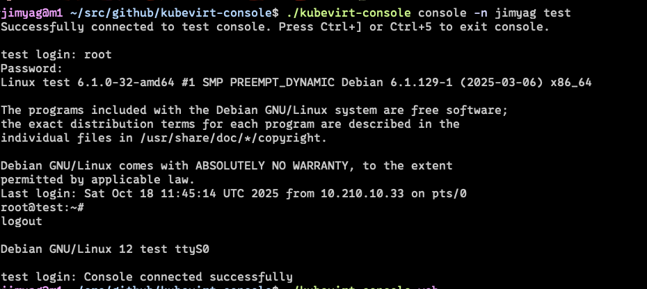

# KubeVirt Console

KubeVirt Console is a single self-contained Go binary that lets you attach to VirtualMachineInstance (VMI) serial consoles from either a local terminal or a browser-based xterm.js UI.

- **Bring-your-own kubeconfig** – relies on the standard KubeVirt client-go configuration, so kubeconfig/env handling works out of the box.
- **Terminal or browser** – connect directly from your shell, or launch an embedded web server that serves an xterm.js frontend.
- **No extra assets** – the web UI, JS, and CSS are embedded so the binary stays portable.

## Prerequisites

- Access to a Kubernetes cluster with KubeVirt installed and an authenticated kubeconfig

## Build

```bash
go build -o kubevirt-console .
```

## CLI usage

Connect your local terminal to a VMI (similar to `virtctl console`):

```bash
./kubevirt-console console [-n <namespace>] <vmi-name>
```

If you omit `-n/--namespace`, the namespace from the active kubeconfig context is used. Press `Ctrl+]` (escape sequence 29) to exit, or wait for the VMI to disconnect.



## Web console mode

Serve the embedded UI and access the console through the browser:

```bash
./kubevirt-console web --listen 127.0.0.1:8080
```

Visit `http://127.0.0.1:8080/` and fill in the namespace and VMI. The page automatically syncs those fields into the URL (so you can bookmark/share the link) and streams the serial console over WebSocket. If you leave the namespace empty, the server falls back to the namespace from your kubeconfig context. Terminal output includes connection status, and any errors are highlighted next to the Connect button.


## Updating embedded web assets

Instructions for refreshing xterm.js bundles live in `web/README.md`.

## Kubernetes deployment

A sample manifest lives in `manifest/deploy.yaml`. It creates a dedicated namespace, service account, cluster-wide RBAC permitting access to `virtualmachineinstances/console`, a `Deployment`, and a `ClusterIP` Service listening on port 80 (forwarded to the pod's 8080). Apply it with:

```bash
kubectl apply -f manifest/deploy.yaml
```

After the pod is running, expose the web UI locally (for example):

```bash
kubectl port-forward -n kubevirt-console deploy/kubevirt-console 8080:80
```

Then open `http://127.0.0.1:8080/` to reach the embedded xterm UI.

### Expose with NodePort

For clusters without an Ingress controller, you can expose the service externally via `manifest/nodeport.yaml`:

```bash
kubectl apply -f manifest/nodeport.yaml
```

This creates a `NodePort` service on TCP port `30000`. Adjust `spec.ports[0].nodePort` (between 30000-32767 by default) to fit your environment, and make sure the corresponding port is reachable on your nodes. You can then access the console at `http://<node-external-ip>:<nodePort>/`.

### Expose with Ingress

If your cluster runs an Ingress controller, publish the console through the sample manifest in `manifest/ingress.yaml`:

```bash
kubectl apply -f manifest/ingress.yaml
```

Before applying it, adjust the `spec.rules[].host` value (and TLS settings if needed) so it matches a domain you control. The provided annotations assume the NGINX Ingress controller and extend proxy timeouts to accommodate long-lived console sessions. Once the Ingress is created and DNS points to your controller, you can reach the UI at the configured host.

## Roadmap / TODO

- [ ] Add authentication/authorization for the web console so only authorised users can reach VMI terminals.
- [ ] Improve observability (structured logging, metrics, tracing) to support production deployments.
- [ ] Introduce automated tests for CLI parsing and websocket handling to avoid regressions.
- [ ] Polish the frontend UX (inline reconnect support, multi-language support, richer error hints).
- [ ] Provide richer error reporting to distinguish between missing VMIs, RBAC denials, timeouts, etc.
- [ ] Package the deployment as Helm/Kustomize for easier customisation.
- [ ] Harden the release pipeline (security scanning, SBOM, multi-arch validation).
- [ ] Document more operational guidance (troubleshooting, FAQ, configuration examples).
- [ ] Prototype an operator/CRD-based flow for auto-provisioning per-VMI console pods while keeping the shared deployment as the default.
